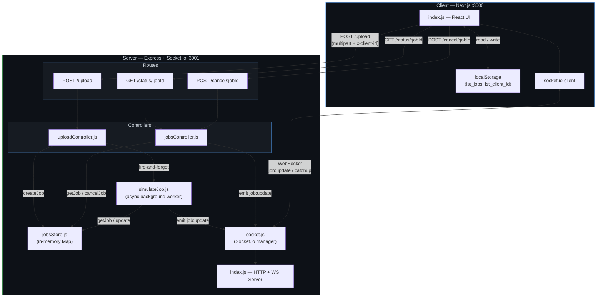
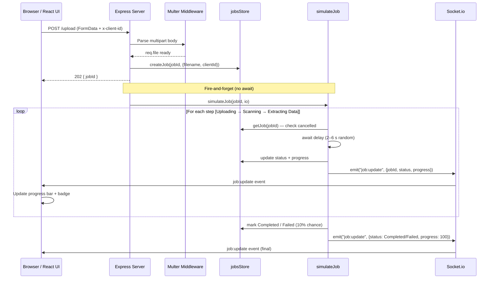
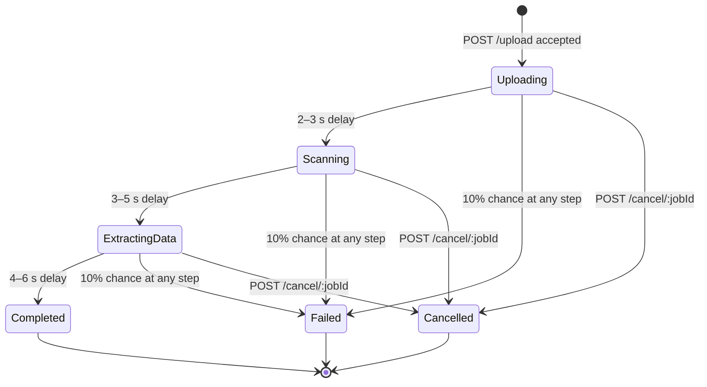

# Live Status Tracker — Architecture Diagram

## 1. High-Level System Architecture



---

## 2. Request Lifecycle — Sequence Diagram



---

## 3. Project Directory Structure

```
LiveStatusTracker/
├── client/                        # Next.js frontend  (:3000)
│   ├── pages/
│   │   ├── _app.js                # Global CSS import
│   │   ├── _document.js           # Custom HTML document (Google Fonts)
│   │   └── index.js               # Main UI — upload form, job cards, socket
│   ├── styles/
│   │   └── globals.css            # Full design system — dark theme, animations
│   └── package.json               # next, react, socket.io-client
│
├── server/                        # Express backend  (:3001)
│   ├── controllers/
│   │   ├── uploadController.js    # Multer parsing, job creation, simulation trigger
│   │   └── jobsController.js      # GET status, POST cancel
│   ├── routes/
│   │   ├── upload.js              # POST /upload
│   │   └── jobs.js                # GET /status/:jobId  ·  POST /cancel/:jobId
│   ├── jobs/
│   │   └── simulateJob.js         # Async background worker (steps + random failure)
│   ├── jobsStore.js               # In-memory job store (create / get / cancel)
│   ├── socket.js                  # Socket.io init, catchup handler, room mgmt
│   ├── index.js                   # Server entrypoint — Express + Socket.io setup
│   └── package.json               # express, socket.io, multer, uuid, cors
│
├── .gitignore
└── README.md
```

---

## 4. Job Simulation — State Machine



---

## 5. Technology Stack

| Layer | Technology | Purpose |
|---|---|---|
| **Frontend** | Next.js 14, React 18 | Pages router, SSR-capable SPA |
| **Styling** | Vanilla CSS (dark theme) | Glassmorphism, micro-animations, responsive |
| **Real-time** | Socket.io (client + server) | Bi-directional WebSocket for live progress |
| **Backend** | Express 4 | REST API, CORS, error handling |
| **File Handling** | Multer (memory storage) | Multipart upload parsing (file not persisted) |
| **State** | In-memory JS object | Job metadata store (non-persistent) |
| **IDs** | uuid v4 | Unique job identifiers |
| **Persistence** | localStorage (client-side) | Job IDs + filenames survive page refresh |

---

## 6. Communication Channels

| Channel | Protocol | Direction | Events / Endpoints |
|---|---|---|---|
| File Upload | HTTP POST | Client → Server | `POST /upload` (multipart/form-data) |
| Job Status Poll | HTTP GET | Client → Server | `GET /status/:jobId` |
| Job Cancel | HTTP POST | Client → Server | `POST /cancel/:jobId` |
| Live Updates | WebSocket | Server → Client | `job:update` (jobId, status, progress) |
| Catchup Sync | WebSocket | Client → Server | `catchup` (jobId) — request current state |
| Connection State | WebSocket | Bi-directional | `connect` / `disconnect` |

---

## 7. Key Design Decisions

- **Room-based emission**: Each client gets a unique `clientId` (persisted in localStorage). The server joins the socket to a room named after this ID, ensuring updates are scoped per-client.
- **Fire-and-forget simulation**: `simulateJob()` runs asynchronously after the HTTP 202 response, so the upload endpoint returns instantly.
- **Catchup on reconnect**: When a WebSocket reconnects, the client re-emits `catchup` for every non-terminal job, so progress is never lost.
- **Optimistic cancel**: The UI marks a job as cancelled immediately, then confirms with the server. If the server call fails, the UI reverts to `failed`.
- **10% random failure**: The simulation randomly fails at any step to demonstrate the error UI path.
