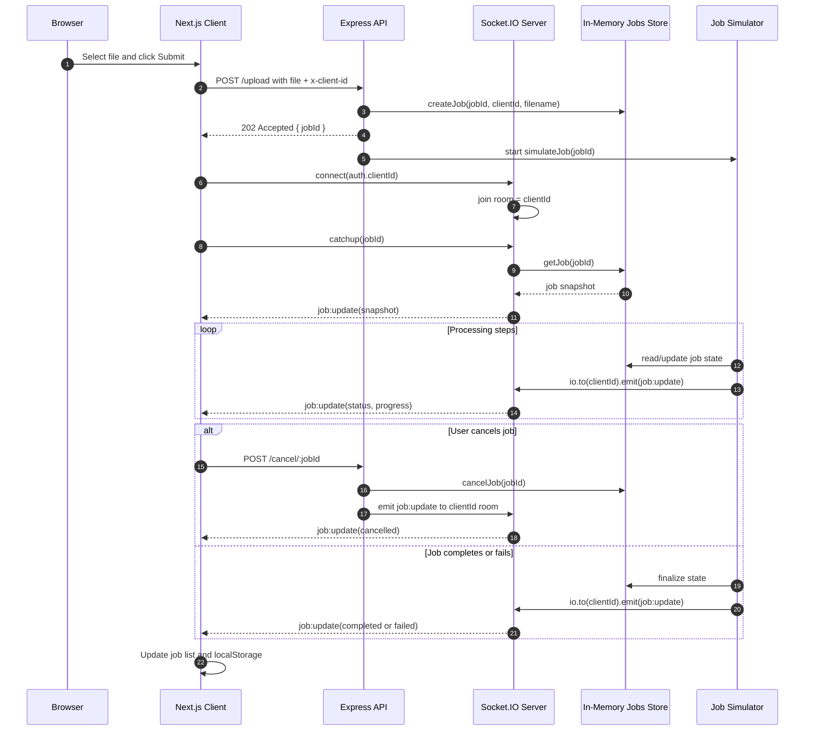

```mermaid
sequenceDiagram
  autonumber
  participant B as Browser
  participant C as Next.js Client
  participant H as Express API
  participant S as Socket.IO Server
  participant M as In-Memory Jobs Store
  participant J as Job Simulator

  B->>C: Select file and click Submit
  C->>H: POST /upload with file + x-client-id
  H->>M: createJob(jobId, clientId, filename)
  H-->>C: 202 Accepted { jobId }
  H->>J: start simulateJob(jobId)

  C->>S: connect(auth.clientId)
  S->>S: join room = clientId
  C->>S: catchup(jobId)
  S->>M: getJob(jobId)
  M-->>S: job snapshot
  S-->>C: job:update(snapshot)

  loop Processing steps
    J->>M: read/update job state
    J->>S: io.to(clientId).emit(job:update)
    S-->>C: job:update(status, progress)
  end

  alt User cancels job
    C->>H: POST /cancel/:jobId
    H->>M: cancelJob(jobId)
    H->>S: emit job:update to clientId room
    S-->>C: job:update(cancelled)
  else Job completes or fails
    J->>M: finalize state
    J->>S: io.to(clientId).emit(job:update)
    S-->>C: job:update(completed or failed)
  end

  C->>C: Update job list and localStorage
```
