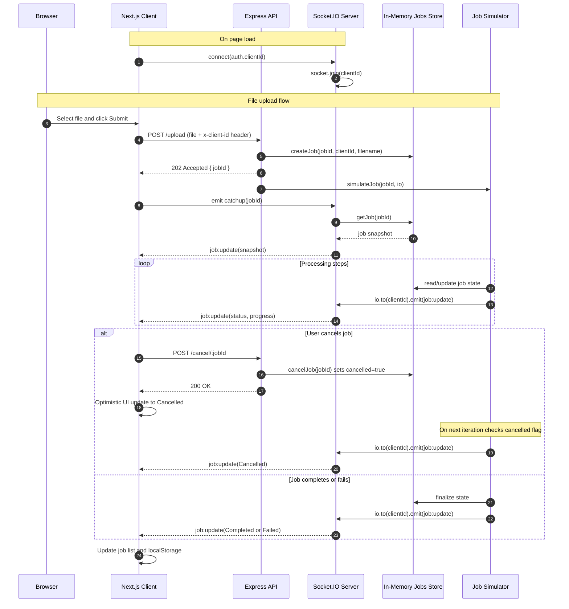

```mermaid
sequenceDiagram
  autonumber
  participant B as Browser
  participant C as Next.js Client
  participant H as Express API
  participant S as Socket.IO Server
  participant M as In-Memory Jobs Store
  participant J as Job Simulator

  Note over C,S: On page load
  C->>S: connect(auth.clientId)
  S->>S: socket.join(clientId)

  Note over B,J: File upload flow
  B->>C: Select file and click Submit
  C->>H: POST /upload (file + x-client-id header)
  H->>M: createJob(jobId, clientId, filename)
  H-->>C: 202 Accepted { jobId }
  H->>J: simulateJob(jobId, io)
  C->>S: emit catchup(jobId)
  S->>M: getJob(jobId)
  M-->>S: job snapshot
  S-->>C: job:update(snapshot)

  loop Processing steps
    J->>M: read/update job state
    J->>S: io.to(clientId).emit(job:update)
    S-->>C: job:update(status, progress)
  end

  alt User cancels job
    C->>H: POST /cancel/:jobId
    H->>M: cancelJob(jobId) sets cancelled=true
    H-->>C: 200 OK
    C->>C: Optimistic UI update to Cancelled
    Note over J: On next iteration checks cancelled flag
    J->>S: io.to(clientId).emit(job:update)
    S-->>C: job:update(Cancelled)
  else Job completes or fails
    J->>M: finalize state
    J->>S: io.to(clientId).emit(job:update)
    S-->>C: job:update(Completed or Failed)
  end

  C->>C: Update job list and localStorage
```
